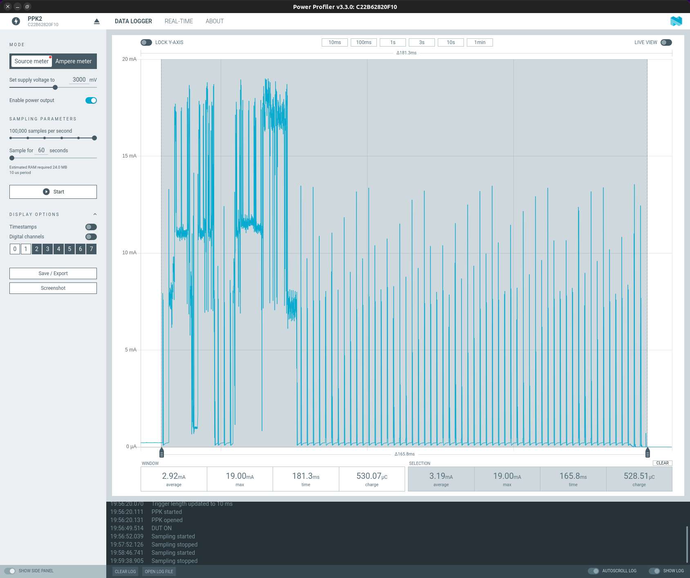

# Project Management

## Init

```bash
mkdir project-nrf-connect-test
cd project-nrf-connect-test
docker run --rm -it -u $(id -u):$(id -g) -v $(pwd):/workdir/project coderbyheart/fw-nrfconnect-nrf-docker:v1.8-branch bash
west init -m https://github.com/fgervais/project-nrf-thread-switch.git .
west update
```

### Add Thread network key

Add `secret.conf` in the `app` folder with content like this which matches your
network key:

```
CONFIG_OPENTHREAD_NETWORKKEY="00:11:22:33:44:55:66:77:88:99:aa:bb:cc:dd:ee:ff"
```

## Docker environment

## Build

```bash
cd application
docker-compose run nrf west build -b nrf52840dongle_nrf52840 -s app
```

## menuconfig

```bash
cd application
docker-compose run nrf west build -b nrf52840dongle_nrf52840 -s app -t menuconfig
```

## Clean

```bash
cd application
rm -rf build/
```

## Flash

```bash
cd application
docker-compose run nrf nrfutil pkg generate \
        --hw-version 52 --sd-req=0x00 \
        --application build/zephyr/zephyr.hex \
        --application-version 1 first.zip

docker-compose run nrf nrfutil dfu usb-serial -pkg first.zip -p /dev/ttyACM0
```

# Hardware


https://github.com/fgervais/project-nrf-thread-switch_hardware

## Border Router


### Setup the RCP firmware on an nRF52840 Dongle

```
git clone --recursive https://github.com/openthread/ot-nrf528xx.git
cd ot-nrf528xx
docker run --rm -u $(id -u):$(id -g) -v $(pwd):/workdir/project nordicplayground/nrfconnect-sdk:v1.9-branch ./script/build nrf52840 USB_trans -DOT_BOOTLOADER=USB -DOT_THREAD_VERSION=1.2
docker run --rm -u $(id -u):$(id -g) -v $(pwd):/workdir/project nordicplayground/nrfconnect-sdk:v1.9-branch arm-none-eabi-objcopy -O ihex build/bin/ot-rcp build/bin/ot-rcp.hex
docker run --rm -u $(id -u):$(id -g) -v $(pwd):/workdir/project nordicplayground/nrfconnect-sdk:v1.9-branch nrfutil pkg generate --hw-version 52 --sd-req=0x00 --application build/bin/ot-rcp.hex --application-version 1 build/bin/ot-rcp.zip
docker run --rm -u $(id -u):$(id -g) -v $(pwd):/workdir/project --group-add 20 --device /dev/ttyACM2 --device /dev/bus/usb nordicplayground/nrfconnect-sdk:v1.9-branch nrfutil dfu usb-serial -pkg build/bin/ot-rcp.zip -p /dev/ttyACM2
```

Related documentation: https://developer.nordicsemi.com/nRF_Connect_SDK/doc/latest/matter/openthread_rcp_nrf_dongle.html

### Start OTBR

```
sudo modprobe ip6table_filter
docker run --sysctl "net.ipv6.conf.all.disable_ipv6=0 net.ipv4.conf.all.forwarding=1 net.ipv6.conf.all.forwarding=1" -p 8080:80 --volume /dev/ttyACM0:/dev/ttyACM0 --privileged openthread/otbr --radio-url spinel+hdlc+uart:///dev/ttyACM0 --nat64-prefix "fd00:64::/96"
```

We use `--nat64-prefix "fd00:64::/96"` so the nat64 will also forward to private
ipv4 addresses.

With the default prefix those forwards are prohibited by [RFC 6052](https://datatracker.ietf.org/doc/html/rfc6052).

# Battery Life

## Power consumption

### Idle


### Button press



## CR2032 expected life


