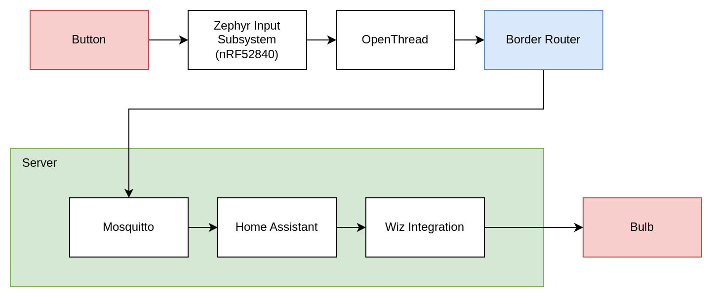

# Thread Switch


# Table of Contents

- [Project Management](#project-management)
- [Hardware](#hardware)
- [Border Router](#border-router)
- [Battery Life](#battery-life)
- [Latency](#latency)

# Project Management

## Init

```bash
mkdir project-nrf-connect-test
cd project-nrf-connect-test
docker run --rm -it -u $(id -u):$(id -g) -v $(pwd):/workdir/project nordicplayground/nrfconnect-sdk:v2.0-branch bash
west init -m https://github.com/fgervais/project-nrf-thread-switch.git .
west update
```

### Add Thread network key

Add `secret.conf` in the `app` folder with content like this which matches your
network key:

```
CONFIG_OPENTHREAD_NETWORKKEY="00:11:22:33:44:55:66:77:88:99:aa:bb:cc:dd:ee:ff"
```

## Docker environment

## Build

```bash
cd application
docker compose run --rm nrf west build -b pink_panda -s app
```

## menuconfig

```bash
cd application
docker compose run --rm nrf west build -b pink_panda -s app -t menuconfig
```

## Clean

```bash
cd application
rm -rf build/
```

## Update

```bash
cd application
docker compose run --rm nrf west update
```

## Flash

### nrfutil

```bash
cd application
docker compose run --rm nrf nrfutil pkg generate \
        --hw-version 52 --sd-req=0x00 \
        --application build/zephyr/zephyr.hex \
        --application-version 1 first.zip

docker compose -f docker-compose.yml -f docker-compose.device.yml run nrf \
        nrfutil dfu usb-serial -pkg first.zip -p /dev/ttyACM0
```

### pyocd
```bash
cd application
pyocd flash -e sector -t nrf52840 -f 4000000 build/zephyr/zephyr.hex
```

# Hardware


- https://github.com/fgervais/project-MS88SF3-breakout
- https://github.com/fgervais/project-nrf-thread-switch_hardware/tree/master/cardboard-enclosure

## Border Router


### Setup the RCP firmware on an nRF52840 Dongle

```
git clone --recursive https://github.com/openthread/ot-nrf528xx.git
cd ot-nrf528xx

wget https://developer.arm.com/-/media/Files/downloads/gnu-rm/9-2020q2/gcc-arm-none-eabi-9-2020-q2-update-"$(arch)"-linux.tar.bz2
tar xf gcc-arm-none-eabi-9-2020-q2-update-x86_64-linux.tar.bz2

docker run --rm -u $(id -u):$(id -g) -v $(pwd):/workdir/project nordicplayground/nrfconnect-sdk:v2.0-branch \
        bash -c 'PATH=$PATH:/workdir/project/gcc-arm-none-eabi-9-2020-q2-update/bin ./script/build nrf52840 USB_trans -DOT_BOOTLOADER=USB'
docker run --rm -u $(id -u):$(id -g) -v $(pwd):/workdir/project nordicplayground/nrfconnect-sdk:v2.0-branch \
        bash -c 'PATH=$PATH:/workdir/project/gcc-arm-none-eabi-9-2020-q2-update/bin arm-none-eabi-objcopy -O ihex build/bin/ot-rcp build/bin/ot-rcp.hex'
docker run --rm -u $(id -u):$(id -g) -v $(pwd):/workdir/project nordicplayground/nrfconnect-sdk:v2.0-branch \
        nrfutil pkg generate --hw-version 52 --sd-req=0x00 --application build/bin/ot-rcp.hex --application-version 1 build/bin/ot-rcp.zip
docker run --rm -u $(id -u):$(id -g) -v $(pwd):/workdir/project --group-add 20 --device /dev/ttyACM2 --device /dev/bus/usb nordicplayground/nrfconnect-sdk:v2.0-branch \
        nrfutil dfu usb-serial -pkg build/bin/ot-rcp.zip -p /dev/ttyACM2
```

Related documentation: https://developer.nordicsemi.com/nRF_Connect_SDK/doc/latest/matter/openthread_rcp_nrf_dongle.html

### Start OTBR

```
sudo modprobe ip6table_filter
docker run --sysctl "net.ipv6.conf.all.disable_ipv6=0 net.ipv4.conf.all.forwarding=1 net.ipv6.conf.all.forwarding=1" -p 8080:80 --volume /dev/ttyACM0:/dev/ttyACM0 --privileged openthread/otbr --radio-url spinel+hdlc+uart:///dev/ttyACM0 --nat64-prefix "fd00:64::/96"
```

We use `--nat64-prefix "fd00:64::/96"` so the nat64 will also forward to private
ipv4 addresses.

With the default prefix those forwards are prohibited by [RFC 6052](https://datatracker.ietf.org/doc/html/rfc6052).

# Battery Life

## Power consumption

### Idle

Average: 2.43µA

The child (SED) poll period is set to 236s.

This selection is a full window starting from after the previous poll to after
this last poll.


### Button press

Each press: 2.03mC


## CR2032 expected life

Based on commit [`9aaf1e6efb23c5ed54ebaed8196d6e84e29ed6b3`](https://github.com/fgervais/project-nrf-thread-switch/tree/9aaf1e6efb23c5ed54ebaed8196d6e84e29ed6b3/app)

Energizer CR2032 = $810 \\, C$

### Idle all the time

```math
\frac{810 \, C}{2.43 \times 10^-6 \, \frac{C}{s}} = 333.33 \times 10^6 \, s
```

```math
333.33 \times 10^6 \, seconds \times \frac{1 \, minute}{60 \, second} \times \frac{1 \, hour}{60 \, minute} \times \frac{1 \, day}{24 \, hour} \times \frac{1 \, year}{365.25 \, days} = 10.56 \, years
```

### 50 presses per day

Idle consumption per day:
```math
2.43 \times 10^-6 \, \frac{C}{s} \times (60 \times 60 \times 24) = 209.95 \times 10^-3 \frac{C}{day}
```

Press consumption per day:
```math
2.03 \times 10^-3 \, C \times 50 = 101.5 \times 10^-3 \, C
```

Total per day:
```math
209.95 \times 10^-3 \frac{C}{day} + 101.5 \times 10^-3 \, \frac{C}{day} = 311.45 \times 10^-3 \, \frac{C}{day}
```

Runtime:
```math
810 \, C \div 311.45 \times 10^-3 \, \frac{C}{day} = 2600.72 \, days = 7.12 \, years
```

Note: We did not substract the press time from the idle time. It will affect 
negatively the calculated expected runtime but it should be negligible.

# Latency

The latency has been tested on the following configuration:



The total latency from electrical button press to light getting out from the
bulb is about `85ms`.


## Demo video

https://youtu.be/jIQvGgGMjlc?si=NDuA6ThBVkoR1B08

## Button press to MQTT publish ACK reception

This is the time from the button press event of the Zephyr subsystem to receiving
the Publish ACK from the MQTT server.

Those logs are enabled from those settings:

```
CONFIG_INPUT_LOG_LEVEL_DBG=y
CONFIG_NET_TCP_LOG_LEVEL_DBG=y
```

```
[00:22:36.410,217] <dbg> zephyr_gpio_keys: gpio_keys_change_deferred: gpio_change_deferred gpio-keys0 pin_state=0, new_pressed=1, key_index=0
[00:22:36.410,247] <dbg> zephyr_gpio_keys: gpio_keys_change_deferred: Report event gpio-keys0 1, code=10
[00:22:36.410,308] <inf> main: GPIO_KEY gpio-keys0 pressed, zephyr_code=10, value=1
[00:22:36.410,369] <inf> mqtt: 📤 action_button/732107abe638a2a4/trigger/button_short_press_button_1/action
[00:22:36.410,400] <inf> mqtt:    └── payload: PRESS
[00:22:36.410,461] <inf> openthread: 👋 request low latency (mqtt_publish)
[00:22:36.410,491] <inf> openthread: ⏰ events: 00000001
[00:22:36.410,491] <inf> openthread:    └── ⏩ start low latency
[00:22:36.410,827] <dbg> net_tcp: tcp_window_full: (input): conn: 0x2001c8b8 window_full=0
[00:22:36.410,858] <dbg> net_tcp: net_tcp_queue_data: (input): conn: 0x2001c8b8 Queued 84 bytes (total 84)
[00:22:36.410,888] <dbg> net_tcp: tcp_unsent_len: (input): unsent_len=84
[00:22:36.411,285] <dbg> net_tcp: tcp_out_ext: (input): ACK,PSH Seq=2990292615 Ack=967402262 Len=84
[00:22:36.411,529] <dbg> net_tcp: tcp_send_process_no_lock: (input): ACK,PSH Seq=2990292615 Ack=967402262 Len=84 
[00:22:36.411,773] <dbg> net_tcp: tcp_send: (input): ACK,PSH Seq=2990292615 Ack=967402262 Len=84
[00:22:36.412,658] <dbg> net_tcp: tcp_send_data: (input): conn: 0x2001c8b8 total=84, unacked_len=84, send_win=2730, mss=1220
[00:22:36.412,689] <dbg> net_tcp: tcp_send_data: (input): conn: 0x2001c8b8 send_data_timer=0, send_data_retries=0
[00:22:36.412,719] <dbg> net_tcp: tcp_unsent_len: (input): unsent_len=0
[00:22:36.412,872] <dbg> net_tcp: tcp_window_full: (input): conn: 0x2001c8b8 window_full=0
[00:22:36.442,535] <dbg> net_tcp: tcp_in: (rx_q[0]): ACK,PSH Seq=967402262 Ack=2990292699 Len=4 [ESTABLISHED Seq=2990292615 Ack=967402262]
```

In this specific sample, it is about `32ms`.

In my experience, it is quite stable around that time.

## Server point of view


The server is composed of `home-assistant` and `eclipse-mosquitto` containers.

### MQTT publish message reception to Wiz light ON message

This is the time from when the server receives the publish message notifying a
button press to when the Wiz integration of Home Assistant gets the turn ON
request out.

About `2ms`.

### MQTT publish message reception to Wiz light ON confirmation

This is the time from when the server receives the publish message notifying a
button press to when the server receives the confirmation from the bulb that
it turned ON.

About `77ms`.
